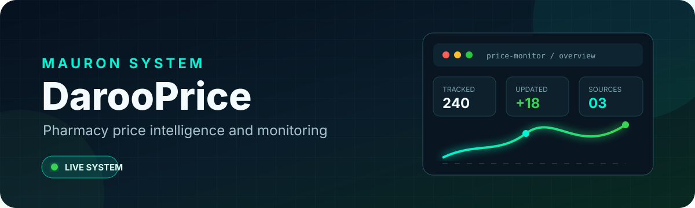

  

  
  
  

## Overview

**DarooPrice** is a production pharmacy price-intelligence platform that monitors product prices across multiple online sources and turns changes into a searchable operational dashboard.

<a href="https://darooprice.com"><strong>View the live platform &rarr;</strong></a>

## Core capabilities

- Multi-source product and price monitoring
- Searchable product catalog with price history
- Submission, review, approval, and duplicate-control workflows
- Low-rate background workers with backoff and error handling
- User update tracking and Telegram notifications
- Dockerized production deployment with persistent PostgreSQL storage

## Technology

`Django 5.2` · `PostgreSQL 16` · `Python` · `Docker` · `Gunicorn` · `Nginx` · `Chart.js`

## Repository policy

> This is a public product showcase. Production source code, worker logic, deployment configuration, database content, credentials, and private operational documentation are maintained in a separate private repository.

Designed, engineered, and maintained by <a href="https://github.com/mehdimauron">MAURON</a>.

